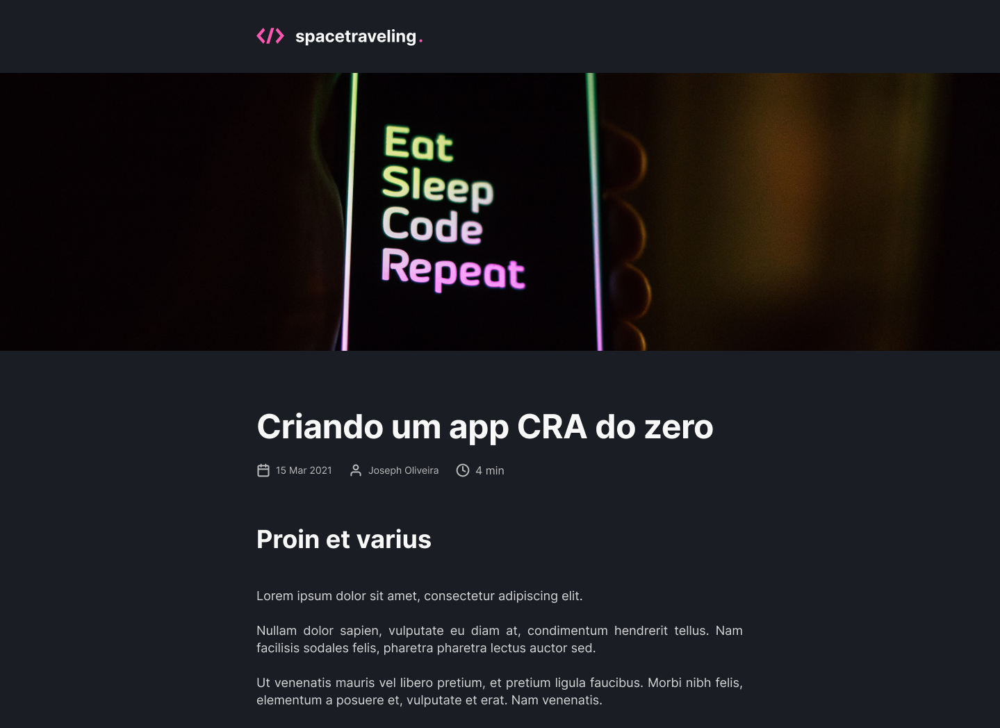

<h1 align="center">
  
</h1>

  <a href="#-tecnologias">Tecnologias</a>&nbsp;&nbsp;&nbsp;|&nbsp;&nbsp;&nbsp;
  <a href="#-projeto">Projeto</a>&nbsp;&nbsp;&nbsp;|&nbsp;&nbsp;&nbsp;
  <a href="#-layout">Layout</a>&nbsp;&nbsp;&nbsp;|&nbsp;&nbsp;&nbsp;
  <a href="#-como-executar">Como executar</a>&nbsp;&nbsp;&nbsp;|&nbsp;&nbsp;&nbsp;
  <a href="#-licença">Licença</a>

 

  

## ✨ Tecnologias

Esse projeto foi desenvolvido com as seguintes tecnologias:

- [Next.js](https://nextjs.org/)
- [TypeScript](https://www.typescriptlang.org/)
- [Prismic](https://prismic.io/)
- [SASS](https://sass-lang.com/)
- [Utterances](https://utteranc.es/)

## 💻 Projeto

O **spacetraveling** é uma aplicação em formato de blog. Desenvolvido módulo 3 do treinamento Ignite da [Rocketseat](https://rocketseat.com.br/) a partir de um scaffold, apenas com testes e arquivos template.

## 🔖 Layout

Você pode visualizar o layout do projeto através [desse link](https://www.figma.com/file/0Y26j0tf1K2WB5c1ja5hov/Desafios-M%C3%B3dulo-3-ReactJS/duplicate).

## 🚀 Como executar

- Clone o repositório
- Instale as dependências com `yarn`
- Inicie o servidor com `yarn start`

Agora você pode acessar [`localhost:3000`](http://localhost:3000) do seu navegador.

## 📄 Licença

Esse projeto está sob a licença MIT. Veja o arquivo [LICENSE](LICENSE.md) para mais detalhes.
